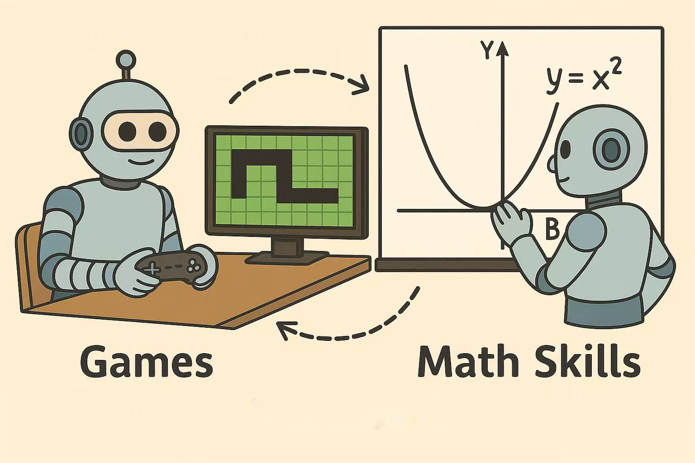

<div align="center">

#  🎮 *Play to Generalize*:<br>  Learning to Reason Through Game Play


<p>
    
</p>


<a href="https://arxiv.org/abs/2506.08011" target="_blank">
    
</a>
<a href="https://yunfeixie233.github.io/ViGaL/" target="_blank">
    
</a>
<br>
<a href="https://huggingface.co/yunfeixie/ViGaL-7B" target="_blank">
    
</a>
<a href="" target="_blank">
    
</a>


<div style="font-family: charter;">
    <a href="https://yunfeixie233.github.io/" target="_blank">Yunfei Xie</a>,
    <a href="https://openreview.net/profile?id=~Yinsong_Ma1" target="_blank">Yinsong Ma</a>,
    <a href="https://voidrank.github.io/" target="_blank">Shiyi Lan</a>,
    <a href="https://www.cs.jhu.edu/~ayuille/" target="_blank">Alan Yuille</a>,
    <br>
    <a href="https://lambert-x.github.io/" target="_blank">Junfei Xiao†</a>,
    <a href="https://weichen582.github.io/" target="_blank">Chen Wei§</a>
</div>

§Corresponding Author, †Project Lead

</div>
<br>


## 🎯 Overview

We propose a novel post-training paradigm, **Visual Game Learning (ViGaL)**, where MLLMs develop out-of-domain generalization of multimodal reasoning through playing arcade-like games. Specifically, we show that post-training a 7B-parameter MLLM via reinforcement learning (RL) on simple arcade-like games like Snake and Rotation puzzle significantly enhances its downstream performance on multimodal reasoning benchmarks such as MathVista, MathVerse, and MathVision, **without seeing any worked solutions, equations, or diagrams during RL**. Remarkably, the resulting model surpasses large-scale proprietary models and models tuned directly on visual math datasets. Ablation studies indicate that distinct games unlock complementary reasoning skills, leading to improved generalization when combined. Our findings suggest a new post-training paradigm: synthetic, rule-based games can serve as controllable and scalable pre-text tasks that effectively unlock generalizable multimodal reasoning abilities in MLLMs.


## 🗞️ News

## 📋 Contents
- [Installation](#-installation)
- [ViGaL Weights](#-vigal-weights)
- [Data Preparation](#-data-preparation)
- [Train](#-train)
- [Evaluation](#-evaluation)
- [Results](#-results)

## 📦 Installation
```shell
git clone https://github.com/yunfeixie233/ViGaL.git
cd ViGaL
pip install -e .[vllm]
pip install flash_attn --no-build-isolation
```

## 🤖 ViGaL Weights
Please see [ViGaL Weights](https://huggingface.co/yunfeixie/ViGaL-7B).

## 📂 Data Preparation
You can download our training data from [ViGaL training data (Coming Soon)](#) (link will be available soon)

## 🌐 Train

- For Snake game:
  ```shell
  sh examples/scripts/train_snake.sh
  ```

- For Rotation game:
  ```shell
  sh examples/scripts/train_rotation.sh
  ```

- For Snake and Rotation games:
  ```shell
  sh examples/scripts/train_snake_rotation.sh
  ```

## 🔭 Evaluation

- **For MathVista, MathVision, and MathVerse:**
  We use the evaluation code in the `eval/` directory.

- **For CLEVR+ and Geometry:**
  Please implement the evaluation following [Reason-RFT](https://github.com/tanhuajie/Reason-RFT?tab=readme-ov-file#--evaluation).

- **For MMMU validation set evaluation:**
  Please implement the evaluation following [Qwen2.5-VL](https://github.com/QwenLM/Qwen2.5-VL).

- **For other general visual evaluation:**
  Please implement the evaluation following [VLMEvalKit](https://github.com/open-compass/VLMEvalKit).

## 🎮 Results

### Improvement on Unseen Reasoning Tasks

We evaluate ViGaL trained on games on out‑of‑domain tasks that demand reasoning spanning mathematics, 3D understanding in CLEVR+, geometric problem solving, and multi‑discipline on MMMU series. Here are our findings:

- **Zero‑shot generalization from gameplay to math reasoning and beyond.** ViGaL outperforms models specifically fine‑tuned with RL on mathematical, spatial, and multi‑discipline reasoning tasks, showing remarkable generalization capabilities despite having no exposure to in‑domain training data during RL post‑training.
- **Blending both games leads to better generalization.** Visual Game Learning shows promise as a new training paradigm that can enhance generalizable reasoning performance without requiring extensive collections of domain‑specific training data. Simply expanding the diversity of games during training leads to consistent performance scaling across various visual‑reasoning problems.
- **Preserving general visual capabilities while reasoning enhancement.** Experiments on more general and comprehensive multimodal benchmarks show that our gameplay‑based approach enables math generalization without compromising other visual abilities.

<table>
<thead>
<tr>
<th rowspan="2">Model</th>
<th rowspan="2">Avg.</th>
<th colspan="4">Math</th>
<th colspan="3">Geometry</th>
<th colspan="3">CLEVR+</th>
<th colspan="3">Multi‑Discipline</th>
</tr>
<tr>
<th>Avg.</th>
<th>MathVista</th>
<th>MathVerse</th>
<th>MathVision</th>
<th>Avg.</th>
<th>GeoMath</th>
<th>Geo3K</th>
<th>Avg.</th>
<th>CLEVR‑M</th>
<th>S‑CLEVR</th>
<th>Avg.</th>
<th>MMMU<sub>val</sub></th>
<th>MMMU‑Pro<sub>overall</sub></th>
</tr>
</thead>
<tbody>
<tr><td colspan="15" style="text-align:center; font-style:italic;"><strong>Proprietary Model</strong></td></tr>
<tr><td>GPT‑4o</td><td>51.7</td><td>48.1</td><td>61.4</td><td>50.2</td><td>30.4</td><td>46.8</td><td>50.2</td><td>43.5</td><td>51.2</td><td>68.1</td><td>34.3</td><td>60.5</td><td>69.1</td><td>51.9</td></tr>
<tr><td>Gemini‑2.0‑Flash</td><td>-</td><td>56.4</td><td>73.4</td><td>54.6</td><td>41.3</td><td>54.4</td><td>55.3</td><td>53.5</td><td>46.3</td><td>64.9</td><td>27.6</td><td>-</td><td>71.9</td><td>-</td></tr>
<tr><td colspan="15" style="text-align:center; font-style:italic;"><strong>General Multimodal Language Model</strong></td></tr>
<tr><td>InternVL2.5‑8B</td><td>51.5</td><td>41.2</td><td>64.4</td><td>39.5</td><td>19.7</td><td>55.2</td><td>63.0</td><td>47.3</td><td>64.4</td><td>93.5</td><td>35.3</td><td>45.2</td><td>56.0</td><td>34.3</td></tr>
<tr><td>Llava‑OV‑7B</td><td>-</td><td>-</td><td>63.2</td><td>26.2</td><td>-</td><td>60.7</td><td>77.6</td><td>43.7</td><td>49.4</td><td>69.7</td><td>29.1</td><td>36.5</td><td>48.8</td><td>24.1</td></tr>
<tr><td>Qwen2.5‑VL‑7B</td><td>48.3</td><td>47.7</td><td>68.0</td><td>49.0</td><td>26.0</td><td>44.8</td><td>44.0</td><td>45.6</td><td>54.9</td><td>74.6</td><td>35.2</td><td>45.7</td><td>54.3</td><td>37.0</td></tr>
<tr><td colspan="15" style="text-align:center; font-style:italic;"><strong>Multimodal Reasoning Model Post‑Trained on Qwen2.5‑VL‑7B</strong></td></tr>
<tr><td>R1‑Onevision‑7B</td><td>47.3</td><td><em>46.8</em></td><td><em>64.1</em></td><td><em>46.4</em></td><td><em>29.9</em></td><td>35.0</td><td>45.4</td><td>24.5</td><td><em>65.1</em></td><td><em>75.5</em></td><td><em>54.7</em></td><td>42.3</td><td>51.9</td><td>32.6</td></tr>
<tr><td>R1‑VL‑7B</td><td>47.3</td><td><em>42.7</em></td><td><em>63.5</em></td><td><em>40.0</em></td><td><em>24.7</em></td><td><em>39.0</em></td><td><em>42.0</em></td><td><em>36.1</em></td><td><em>68.0</em></td><td><em>87.4</em></td><td><em>48.6</em></td><td>39.7</td><td>50.0</td><td>29.4</td></tr>
<tr><td>MM‑Eureka‑Qwen‑7B</td><td>51.1</td><td><em>50.1</em></td><td><em>73.0</em></td><td><em>50.3</em></td><td><em>26.9</em></td><td><em>28.4</em></td><td><em>53.1</em></td><td><em>3.8</em></td><td><strong>79.3</strong></td><td><strong>98.4</strong></td><td><strong>60.1</strong></td><td>46.4</td><td>55.8</td><td>36.9</td></tr>
<tr><td>Reason‑RFT‑Zero‑7B</td><td>52.5</td><td>38.1</td><td>60.7</td><td>35.3</td><td>18.3</td><td><em>54.9</em></td><td><em>55.0</em></td><td><em>54.8</em></td><td><em>76.2</em></td><td><em>99.4</em></td><td><em>53.0</em></td><td>40.9</td><td>51.2</td><td>30.6</td></tr>
<tr><td>VLAA‑Thinker‑7B</td><td>56.5</td><td><em>48.7</em></td><td><em>68.0</em></td><td><em>51.7</em></td><td><em>26.4</em></td><td><em>53.9</em></td><td><em>51.1</em></td><td><em>56.6</em></td><td><em>83.4</em></td><td><em>94.7</em></td><td><em>72.1</em></td><td>40.1</td><td>48.2</td><td>31.9</td></tr>
<tr><td>OpenVLThinker‑7B</td><td>56.3</td><td><em>47.8</em></td><td><em>70.2</em></td><td><em>47.9</em></td><td><em>25.3</em></td><td><em>56.4</em></td><td><em>49.2</em></td><td><em>63.5</em></td><td><em>82.4</em></td><td><em>93.8</em></td><td><em>71.0</em></td><td>38.5</td><td>54.8</td><td>22.1</td></tr>
<tr><td>ViGaL Snake</td><td>58.3</td><td>49.4</td><td>70.7</td><td>51.1</td><td>26.5</td><td>55.0</td><td>49.9</td><td>60.0</td><td><strong>82.6</strong></td><td>92.6</td><td>72.6</td><td>46.2</td><td>55.8</td><td>36.6</td></tr>
<tr><td>ViGaL Rotation</td><td>58.4</td><td>49.3</td><td>71.2</td><td>50.4</td><td>26.3</td><td><strong>57.9</strong></td><td>51.7</td><td>64.1</td><td>80.7</td><td>93.0</td><td>68.3</td><td>45.9</td><td>54.1</td><td>37.7</td></tr>
<tr><td><strong>ViGaL Snake + Rotation</strong></td><td><strong>59.3</strong></td><td><strong>50.6</strong></td><td>71.9</td><td>52.4</td><td>27.5</td><td>57.1</td><td>51.0</td><td>63.3</td><td>81.7</td><td>91.9</td><td>71.4</td><td><strong>47.7</strong></td><td>58.0</td><td>37.4</td></tr>
</tbody>
</table>

**Main results on multimodal reasoning benchmarks.** We primarily compare with multimodal reasoning models post‑trained on math data based on Qwen2.5‑VL‑7B. CLEVR‑M denotes CLEVR‑Math, and S‑CLEVR stands for Super‑CLEVR. Results from reasoning models post‑trained with corresponding in‑domain data are <em>de‑emphasized</em>, while our ViGaL models remain exclusively post‑trained using visual games. Best scores of post‑trained models in each "Avg." column are highlighted in **bold**.

<table>
<thead>
<tr>
<th rowspan="2">Model</th>
<th rowspan="2">Avg.</th>
<th colspan="3">General</th>
<th colspan="6">Vision‑Centric</th>
<th colspan="5">OCR & Chart</th>
</tr>
<tr>
<th>Avg.</th>
<th>Muir‑Bench</th>
<th>CRPE<sub>rel.</sub></th>
<th>Avg.</th>
<th>MMVP</th>
<th>Real‑WorldQA</th>
<th>MMStar</th>
<th>BLINK<sub>val</sub></th>
<th>MME<sub>p</sub></th>
<th>Avg.</th>
<th>AI2D<sub>w. M.</sub></th>
<th>SEED‑Bench‑2+</th>
<th>DocVQA<sub>val</sub></th>
<th>OCR‑Bench</th>
</tr>
</thead>
<tbody>
<tr><td colspan="16" style="text-align:center; font-style:italic;"><strong>Proprietary Model</strong></td></tr>
<tr><td>GPT‑4o</td><td>74.8</td><td>72.3</td><td>68.0</td><td>76.6</td><td>69.4</td><td>-</td><td>75.4</td><td>64.7</td><td>68.0</td><td>1614</td><td>82.6</td><td>84.6</td><td>72.0</td><td>91.1</td><td>736</td></tr>
<tr><td colspan="16" style="text-align:center; font-style:italic;"><strong>General Multimodal Language Model</strong></td></tr>
<tr><td>Qwen2.5‑VL‑7B</td><td>72.4</td><td>68.0</td><td>59.6</td><td>76.4</td><td>65.8</td><td>74.3</td><td>68.5</td><td>63.9</td><td>56.4</td><td>1698</td><td>83.3</td><td>83.9</td><td>70.4</td><td>95.7</td><td>864</td></tr>
<tr><td colspan="16" style="text-align:center; font-style:italic;"><strong>Multimodal Reasoning Model Post‑Trained on Qwen2.5‑VL‑7B</strong></td></tr>
<tr><td>R1‑Onevision‑7B</td><td>-</td><td>66.8</td><td>46.3</td><td>87.3</td><td>56.5</td><td>61.3</td><td>58.0</td><td>57.8</td><td>48.7</td><td>1504</td><td>-</td><td>-</td><td>-</td><td>-</td><td>-</td></tr>
<tr><td>R1‑VL‑7B</td><td>67.4</td><td>63.3</td><td>54.1</td><td>72.4</td><td>59.6</td><td>70.3</td><td>61.4</td><td>55.6</td><td>51.0</td><td>1657</td><td>79.2</td><td>81.7</td><td>66.4</td><td>89.4</td><td>81.0</td></tr>
<tr><td>MM‑Eureka‑Qwen‑7B</td><td>71.8</td><td><strong>68.9</strong></td><td>61.1</td><td>76.7</td><td>65.1</td><td>74.3</td><td>66.1</td><td>65.9</td><td>54.0</td><td>1626</td><td>81.5</td><td>84.3</td><td>68.2</td><td>92.0</td><td>87.0</td></tr>
<tr><td>Reason‑RFT‑Zero‑7B</td><td>68.4</td><td>66.9</td><td>58.5</td><td>75.2</td><td>58.5</td><td>58.0</td><td>65.3</td><td>59.1</td><td>51.6</td><td>1653</td><td>79.8</td><td>83.3</td><td>68.0</td><td>88.1</td><td>82.0</td></tr>
<tr><td>VLAA‑Thinker‑7B</td><td>69.7</td><td>65.9</td><td>57.1</td><td>74.6</td><td>62.6</td><td>71.6</td><td>65.4</td><td>60.4</td><td>53.0</td><td>1593</td><td>80.6</td><td>83.4</td><td>67.4</td><td>90.9</td><td>84.5</td></tr>
<tr><td>OpenVLThinker‑7B</td><td>-</td><td>64.3</td><td>52.8</td><td>75.8</td><td>50.4</td><td>32.3</td><td>60.2</td><td>59.1</td><td>49.9</td><td>1513</td><td>-</td><td>-</td><td>-</td><td>-</td><td>-</td></tr>
<tr><td><strong>ViGaL Snake + Rotation</strong></td><td><strong>72.2</strong></td><td>68.6</td><td>60.5</td><td>76.7</td><td><strong>65.7</strong></td><td>74.6</td><td>67.3</td><td>65.4</td><td>55.6</td><td>1685</td><td><strong>82.2</strong></td><td>84.8</td><td>69.1</td><td>92.7</td><td>86.6</td></tr>
</tbody>
</table>

**Main results on multimodal language benchmarks targeting more general and comprehensive visual ability.** We compare with models post‑trained on Qwen2.5‑VL‑7B. Best category averages are highlighted in **bold**. Note that MME<sub>p</sub> is excluded from vision‑centric category average accuracy due to scale differences.

## 📜 Citation

If you find ViGaL useful for your research and applications, please cite using this BibTeX:
```bibtex    
@article{xie2025play,
  title     = {Play to Generalize: Learning to Reason Through Game Play},
  author    = {Xie, Yunfei and Ma, Yinsong and Lan, Shiyi and Yuille, Alan and Xiao, Junfei and Wei, Chen},
  journal   = {arXiv preprint arXiv:2506.08011},
  year      = {2025},
}
```

## 🎓 Acknowledgement

- [MM-EUREKA](https://github.com/ModalMinds/MM-EUREKA/tree/qwen): We start from the codebase from MM-EUREKA